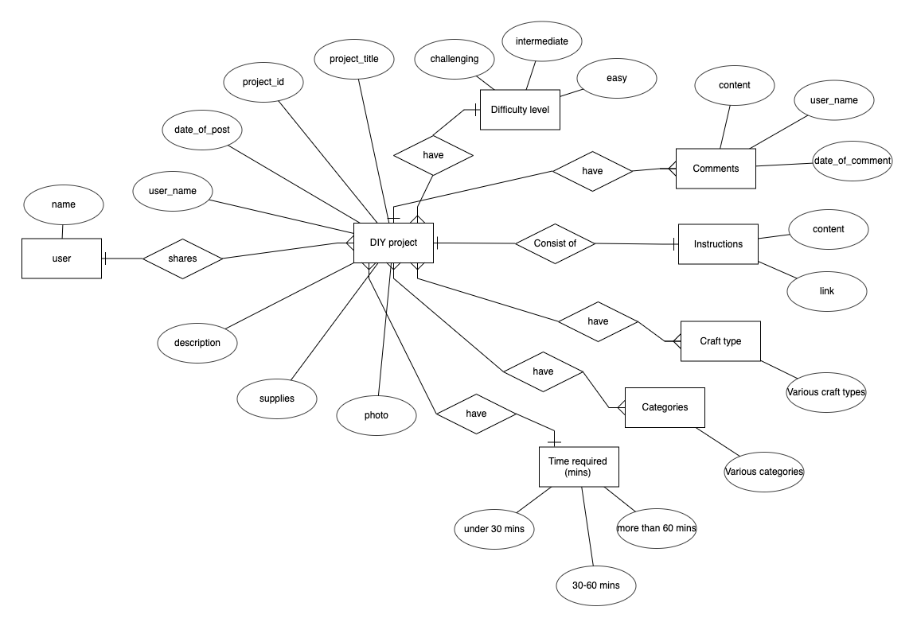
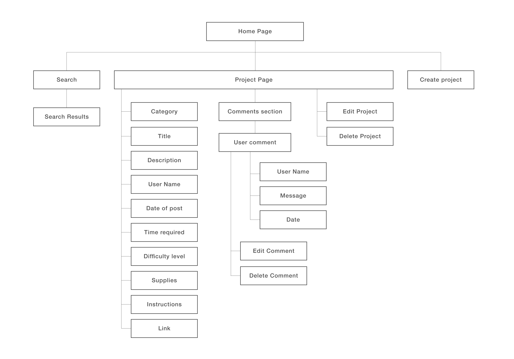
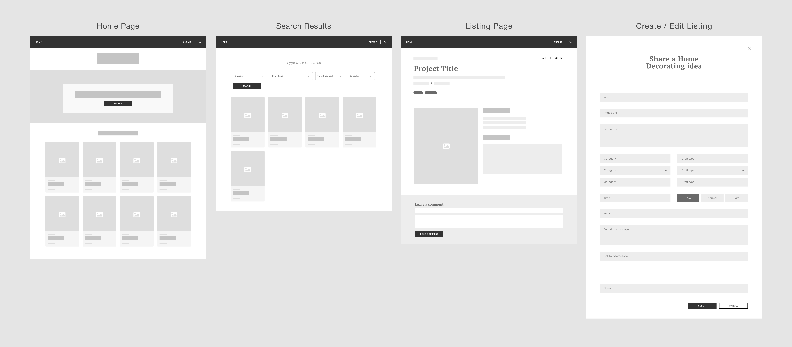

# **HomeMade - DIY Decorating Ideas for the Home**

Access the site here: https://incandescent-cannoli-884258.netlify.app/
 Deployed using Netlify (https://www.netlify.com/)

## 1. Project Summary
### **Background**
An online platform where homeowners and DIY craft enthusiasts can find inspiration and ideas for decorating their homes (also useful for home owners on a tight budget). Users can also share their home decorating ideas and leave comments on crafting advice, styling tips or material recommendations.

### **User Goals**
The aim of users is to discover ideas and inspirations for decorating their home.

### **Organisational Goals & Project Justification**
The website's goal is to bring together a community of home owners and interior DIY enthusiasts to share and exchnage ideas, skills, and knowledge about decorating the home. Home renovation can be costly, and the website can allowe homeowners to discover cheaper and simpler alternatives to spruce up the look of their home.

### **ER Diagram**

### **Sample Mongo Document**
View sample documents here: https://github.com/neomq/TGC16-Assignment-2-React/tree/main/sample%20documents

 

## 2. UI/UX

### **User Stories**
| User Story                                                                                                                                           	| Acceptance Criteria                                                                                                                                                                                  	|
|------------------------------------------------------------------------------------------------------------------------------------------------------	|------------------------------------------------------------------------------------------------------------------------------------------------------------------------------------------------------	|
| As a homeowner, i would like to look for ideas to improve the look of my home                                                                        	| Website allows user to search across a variety of home decor ideas and projects, and search filtering enables the users to perform a more efficient search based on the criteria they have selected. 	|
| As a home decor & DIY craft enthusiast, i would like to share my decorating ideas with the community as well as learn new decorating ideas and tips. 	| Website allows users to post their home decorating idea, and leave decorating and crafting related comments.                                                                                         	|

### **5 Planes of UI/UX**
#### 1. Strategy
1. **Target Users**: Home owners, and home decor enthusiasts.
2. **Users Needs**: To easily search for ideas and inspirations on home decorations and styling, as well as share their own decorating ideas with the community.
3. **Site Objective**: To allow users to search, share and leave comments.

### 2. Scope
**Functional Requirements:**
- Search for posts (with the help of search filters to narrow search and display more relevant search results)
- Create a new post
- Delete an existing post
- Update an existing post
- Post comments
- Edit comments
- Delete comments

**Non-Functional Requirements:**
- Mobile responsiveness

### 3. Structure

1. Nav Bar: Contains clickable search icon to display search bar, and button to submit a post on the website
2. Home Page: displays all the latest posts created by users sorted by chronological order (newest to oldest), and a call to action button for users to start exploring on the site.
3. Search Results Page: displays search results. users can perform a new search on the search bar and select filtering options.
4. Project page: displays information of each home decor project and a comments section for users to leave comments. users can also edit / delete their post from the page, as well as edit / delete comments.
5. Create project page: Users can share their home decorating idea / project by submitting it to the website via a form on this page. Once user clicks on submit, user will be redirected to the home page to view their created post.

### 4. Skeleton
(for Desktop Layout)

### 4. Visual Design

Website is designed with a minimalist approach using monochromatic, neutral colours to allow images of home decorations on the website to stand out and draw users attention and focus to the main contents of the site.

## 3. Features

**Search**
- Users can perform searches on the site via the search bar, and using search filters to help display searches with more relevance.

**Create (submit) a post**
- Users can create a post via a form on the "submit decor" page on the website. After submitting the form, users will be redirected to the home page where they can view their created post.

**View & Edit a post**
- Clicking on a post will direct the user to the listing page to view more details and information, as well as edit the information on the page by clicking an edit button.

**Delete post**
- Users can delete a post on the website by going into the page and clicking on delete. A confirmation dialogue box will prompt the user to confirm the deletion before the post is permanently deleted.

**Comments**
- Users can post, edit and delete comments on each of the listing pages.

**Limitations and future implementations**
1. A user account / login feature to provide access control to the users - allowing them to only edit and delete their own posts and comments. Currently the site allows everyone to edit and delete data on the site.
2. A 'like' feature for users to like and support their favourite post or comments, and users can also sort their searches by most favourited.
3. To refined search function by adding a filter to allow users to sort the results of their searches.

## 4. Technologies Used / Credits

- Built using HTML / CSS / Express / ReactJS
- Database created using MongoDB
- Axios for calling of API
- UI created with Bootstrap (http://getbootstrap.com/)
- Fonts from Google Fonts (https://fonts.google.com/)
- All icons from font awesome (https://fontawesome.com/)
- Home banner image from Unsplash (https://unsplash.com/photos/q3Qd86sfaoU)

**Deployment**
- Heroku to deploy express application
- Netlify to deploy React application

**Data Sources**
 
All data from this project are sourced from the following sites:
- DIY rope trinket bowls (https://www.burkatron.com/2019/02/diy-rope-trinket-bowls.html)
- DIY Fiber Wall Art (http://blueaugustine.com/home-decor-diy-fiber-wall-art/)
- Cinnamon Stick Candles (https://louiseroe.com/2017/12/21/cinnamon-stick-candles/)
- Wood Vase DIY (https://perkinsonparkway.com/2020/10/wood-vase-diy.html)
- Pull Down Wall Hanging Art (https://www.makinghomebase.com/pull-down-wall-hanging/)
- Easter Bunny Garland (https://diycandy.com/easter-bunny-garland/)

## 5. Testing
**Perform basic search**
- From the home page, click on the search icon or the "Search decor" button. A search bar should appear. Enter a search keyword, or select from filters and click on search. Search results should appear on a new page. User is allowed to perform an empty search - in such cases, search will display all data existing in the database.
- If search does not return any results, a message will be displayed to inform the user to try another search.

**View Home Decor project**
- clicking on a listing from the home page or from the search results page will bring you to the project listing page to view more information and details.

**Edit Home Decor project**
- On the project listing page, click on the edit button at the top right. A form will appear for the user to edit all the information. After editing, click on update and user will be redirected back to the project lisitng page to view the updated information.

**Delete Home Decor project**
- On the project listing page, click on the delete button at the top right. A confirmation popup will appear for the user to confirm the deletion. Click on 'No, cancel' and the popup will close and bring the user back to the project listing page. Click on 'Yes, delete' and the project listing will be deleted permanently - user will then be redirected back to the home page.

**Submit Home Decor project**
- From the navigation bar, click on 'Submit Decor'. User will be directed to a new page to submit a new decorating project via a form. All fields are required, except for 'link' which is an optional field. Error messages will appear on the form if user tries to submit an empty form. The error messages will guide the user to input the data correctly. Once the form is completed, click on 'submit' and a new post will be created if there are no further errors, else error messages will appear again. Once the new post is created successfully, users will be directed to the home page to view thier newly created post. 

- At any point of time if the user chooses to cancel and close the form, user will be directed back to the page where they are previosuly, and the site will clear all the inputs keyed in by the user before closing the form. When the user clicks on 'Submit Decor' again, user will not be able to continue where he/she has left off and will have to re-fill in the form to submit a new decorating project.

**Post, Edit, Delete comments**
- Navigate to the project listing page and find the comments section at the end of the page. User can post a comment by keying in their name and comment message, and then click on "Post comment". If user tries to submit a comment when the 'name' and/or 'message' fields are empty, the comment will not be posted.

- User can edit comments by clicking on the edit button on each comment, and update the comment. Comments will be updated on the comments section. Again if user tries to update a comment with empty 'name' and 'message' fields, comment will not be updated.

- User can delete a comment by clicking on delete button on each comment, and the comment will immediately be deleted (no popup alert)

